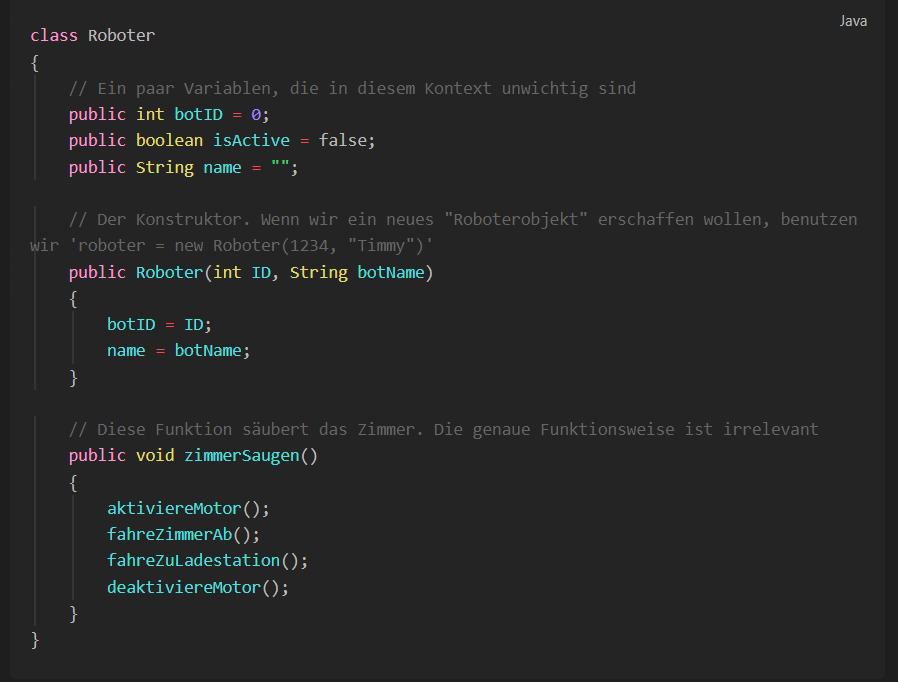
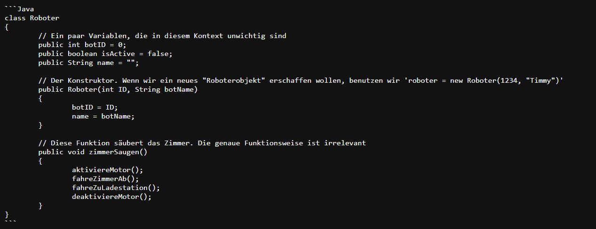

Die absoluten Basics anschaulich erklärt

## Preambel (Sowas wie ne Einleitung)
Ihr findet hier Erklärungen und Aufgaben zu den absoluten Basics vom (objektorientierten) Programmieren. Weil's im Unterricht in NRW in der EF (G8 also 10te) nur mit Java abgeht (ohne Libs in ner Crap IDE wie Greenfoot oder BlueJ), sind Codebeispiele hier alle in Java.

## **Hinweise zur Verwendung**
Es handelt sich hier um sogenannte **Markdown-Files**. Wenn ihr dieses Repo also runterladet und offline in eurem Browser verwendet, achtet unbedingt darauf, einen md parser über die Dateien laufen zu lassen, sonst seht ihr anstatt

Nur dieses unleserliche Chaos:

Viel Spaß!
